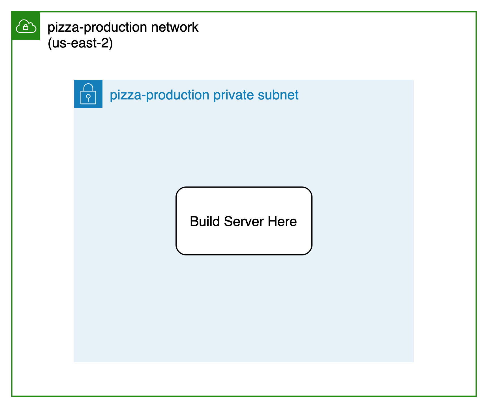
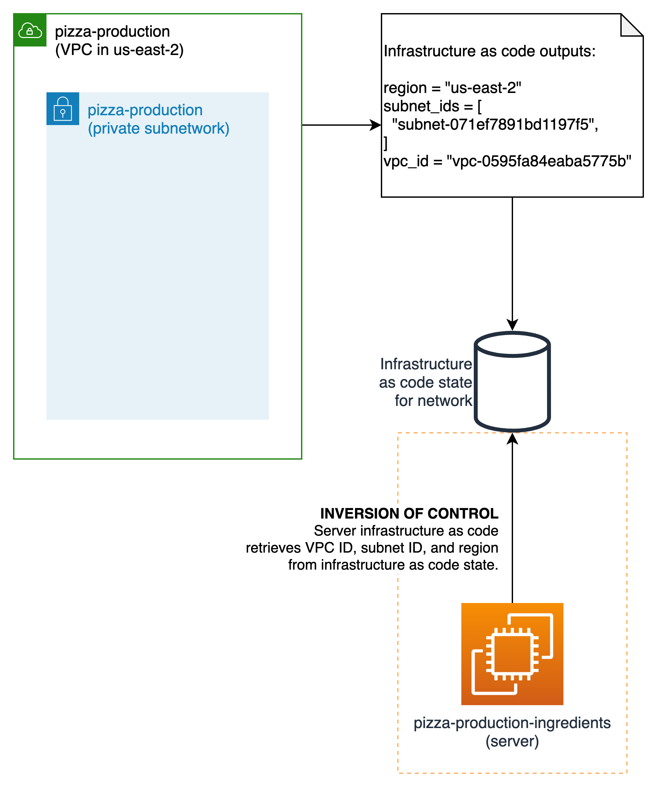
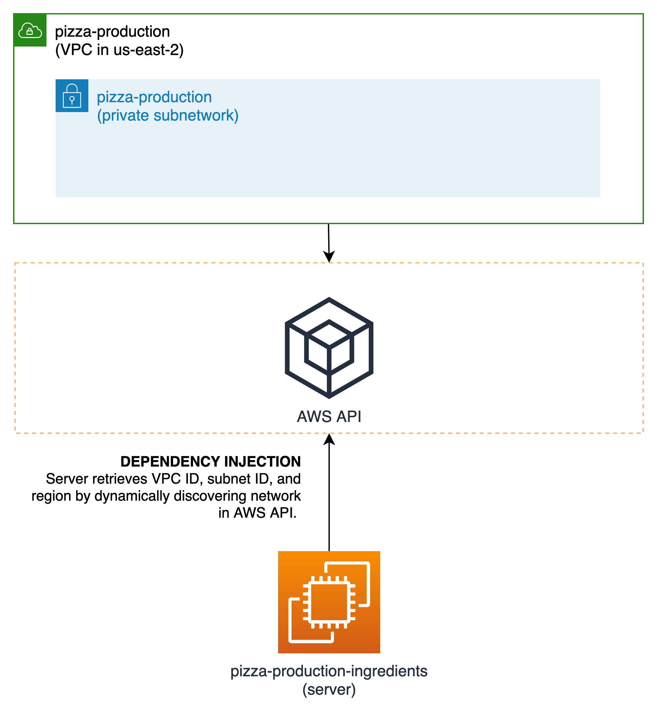

# Manning on Twitch: Dependency Injection for Infrastructure as Code

## Prerequisites

1. [Amazon Web Services](https://aws.amazon.com/getting-started/) account
1. [Terraform](https://www.terraform.io/downloads.html) 1.0+
1. [Python](https://www.python.org/downloads/) 3.9+

## Story

Imagine your network team in uses Terraform, an infrastructure as code tool,
to create networks for application teams to use. They create an AWS
VPC and subnet for you to use (under `network/`).

## Problem

You are on the "Pizza" team and need to create a server on the network.
How do you retrieve information about the network so you can create the
server on it?

## Possible Solution

### Hard-code network identifiers and region

❌ However, the approach doesn't decouple the network and server modules!

> __Try it!__ Change the region of the network. Does the server
> change with it?

## A Better Solution?
### Inversion of control

☎️ Call the low-level dependency for required attributes.

> __Try it!__ Using Terraform, retrieve the network and subnet's
> IDs from the network folder's local state in `server/terraform`.

> __Try it!__ Using Python via the CDK for Terraform, retrieve
> the network and subnet's IDs from the network folder's local state
> in `server/python`.

### Dependency inversion

🍰 Retrieve attributes with a layer of abstraction

In inversion of control, we used state as the layer
of abstraction. We can use other layers of abstraction,
like the infrastructure API or a configuration store.

> __Try it!__ Using Terraform, retrieve the network and subnet's
> IDs from the AWS API instead of state in `server/terraform`.

> __Try it!__ Using Python via the CDK for Terraform, retrieve
> the network and subnet's IDs from the AWS API instead of state
> in `server/python`.

### 🟢 Principle: Dependency injection

__Dependency injection__ combines the principles of inversion of
control and dependency inversion.

> __Try it!__ Change the region of the network. Does the server
> change with it?

You can evolve your server separately from the network. By
decoupling infrastructure as code, you can collaborate on more complicated
systems while minimizing impact!

## References

- [Essential Infrastructure as Code](https://www.manning.com/books/essential-infrastructure-as-code)
- [AWS Provider for Terraform](https://registry.terraform.io/providers/hashicorp/aws/latest/docs)
- [CDK for Terraform](https://github.com/hashicorp/terraform-cdk)